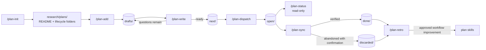

# Plan Skills Workflow

The plan skills manage implementation work under `research/plans/`. The lifecycle folders are:

- `drafts/`: captured requests and plans that still need investigation or decisions.
- `next/`: implementation-ready plans waiting to be dispatched.
- `open/`: dispatched or implemented plans waiting for review, CI, release, deployment, or another dependency.
- `done/`: plans whose acceptance criteria and completion evidence are verified.
- `discarded/`: plans intentionally stopped with a reason and, when available, a replacement link.

`Blocked` is an index category, not a folder. A blocked plan stays in the lifecycle folder that matches its current status and records `blocked_by`.

## Filename Rule

Every new plan is named:

```text
iiot-<NUMBER>-<NAME>.md
```

Use the supplied issue number. If no number is supplied, use `XXXX` and never guess a number:

```text
iiot-XXXX-<inferred-name>.md
```

`<NAME>` is a lowercase, hyphen-separated slug inferred from the request, with no more than four words. Existing legacy files are indexed or archived but are not renamed automatically.

## Workflow



`/plan-spec` is the shared contract read by every lifecycle skill. `task-planning` supplies the detailed implementation-plan format used during investigation.

## Prompts By Stage

### 1. Initialize the lifecycle

```text
/plan-init

Use #file:research as context. Initialize the plan lifecycle at research/plans. Create or verify README.md and the drafts, next, open, done, and discarded folders. Preserve legacy content, do not rename legacy files, do not modify product code, and do not commit. Report every created or existing path.
```

### 2. Capture a request as a draft

With an issue number:

```text
/plan-add

Use #file:research as context. Capture this request as a draft plan:
- Issue number: 2851
- Request: expose application instances through the extension routes
- Constraints: preserve existing route behavior and add focused verification

Create the file as iiot-2851-<inferred-name>.md under research/plans/drafts/. Do not implement product code.
```

Without an issue number:

```text
/plan-add

Use #file:research as context. Capture this request as a draft plan:
- Request: validate dynamic request bodies before forwarding them
- Constraints: preserve current error responses where compatible

No issue number was provided. Use iiot-XXXX-<inferred-name>.md, infer a lowercase name of at most four words, and do not guess a number. Do not implement product code.
```

### 3. Investigate and write the implementation plan

```text
/plan-write iiot-XXXX-dynamic-body-validation.md

Read the draft and its sources. Inspect the smallest controlling code path, neighboring tests, configuration, history, and affected repository boundaries. Classify landed, partial, planned, and blocked work. Write the complete implementation plan with a Mermaid diagram, negative cases, exact verification commands, dependencies, estimates, and done criteria. Move it to research/plans/next/ only when no design decision remains.
```

### 4. Dispatch an approved plan

```text
/plan-dispatch iiot-XXXX-dynamic-body-validation.md

Dispatch this implementation-ready plan to an isolated coding agent. Preserve unrelated worktree changes, run the exact verification commands before and after repairs, record the branch, commits, review URL, checks, deviations, and blockers, and never merge the review.
```

### 5. Report status

```text
/plan-status

Report all plans under research/plans. Validate folder status against frontmatter first, then report readiness, dependencies, review state, CI or release evidence, and person, decision, system, or implementation blockers. This is read-only: do not move plans or mutate external systems.
```

### 6. Synchronize completed work

```text
/plan-sync iiot-XXXX-dynamic-body-validation.md

Compare the plan's acceptance criteria and verification commands with the implementation, review, CI, external work item, release, and deployment evidence. Keep it open if any required evidence is pending. Move it to done only when the completion rule passes, or to discarded only after the Owner or Prompter confirms abandonment. Update the index and outcome without merging or committing.
```

### 7. Learn from completed work

```text
/plan-retro

Review recently done and discarded plans, implementation-agent corrections, review feedback, CI failures, commits, and available session history. Identify repeated workflow problems using at least two examples, propose the smallest exact skill edits, and wait for approval before changing any skill. Do not commit.
```

## Safety Rules

- The Owner is the default plan owner and final reviewer; the Prompter supplies decisions that evidence cannot resolve.
- Never invent an issue number. Use `XXXX` when it is missing.
- Never store credentials, tokens, or secret-bearing conversation text in a plan.
- Do not rename or rewrite legacy plans during initialization.
- Do not merge reviews, transition external work items, trigger releases, or deploy merely to make a plan appear complete.
