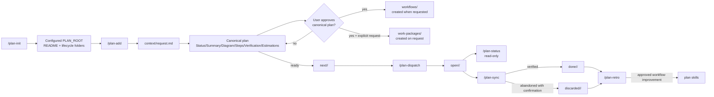

# Plan Skills Workflow

The plan skills manage implementation work under the configured `PLAN_ROOT`. The lifecycle folders are:

- `drafts/`: captured requests and canonical plans that still need investigation or approval.
- `next/`: approved, implementation-ready plan bundles waiting to be dispatched.
- `open/`: dispatched or implemented plans waiting for review, CI, release, deployment, or another dependency.
- `done/`: plans whose acceptance criteria and completion evidence are verified.
- `discarded/`: plans intentionally stopped with a reason and, when available, a replacement link.

`Blocked` is an index category, not a folder. A blocked plan stays in the lifecycle folder that matches its current status and records `blocked_by` in the canonical file.

## Plan Bundle Structure

Each plan is a bundle. The canonical file is the only lifecycle owner; supporting documents are not separate plans.

```text
<PLAN_ROOT>/<lifecycle>/<plan-slug>/
├── <plan-slug>.md
├── context/
│   └── request.md
├── workflows/
└── work-packages/
```

`workflows/` and `work-packages/` remain empty during the initial draft pass. The canonical file is created first and includes empty Related documents subsections for Context, Work packages, and Workflows.

The original request is preserved in `context/request.md`. Workflow documents are created only after the user approves the canonical plan. Work packages are created only after the user explicitly requests them.

## Filename Rule

Every new plan uses the same slug for its bundle directory and canonical file:

```text
<plan-slug>/<plan-slug>.md
```

For plans with an issue number:

```text
plan-<NUMBER>-<NAME>/plan-<NUMBER>-<NAME>.md
```

For plans without an issue number:

```text
plan-XXXX-<inferred-name>/plan-XXXX-<inferred-name>.md
```

`<NAME>` is a lowercase, hyphen-separated slug inferred from the request, with no more than four words. Work packages use `wp-<N>-<short-description>.md`. Existing legacy files are indexed or archived but are not renamed automatically.

## Workflow



`/plan-spec` is the shared contract read by every lifecycle skill. `task-planning` supplies the detailed canonical-plan format used during investigation.

## Prompts By Stage

### 1. Initialize the lifecycle

```text
/plan-init

Resolve PLAN_ROOT from repository or workspace configuration. Create or verify README.md and the drafts, next, open, done, and discarded folders. Preserve legacy content, do not rename legacy files, do not modify product code, and do not commit. Report every created or existing path.
```

### 2. Capture a request as a draft

With an issue number:

```text
/plan-add

Capture this request as a plan bundle:
- Issue number: 2851
- Request: expose application instances through the extension routes
- Constraints: preserve existing route behavior and add focused verification

Create plan-2851-<inferred-name>/ under $PLAN_ROOT/drafts/, preserve the request in context/request.md, and create the canonical Markdown skeleton. Leave workflows/ and work-packages/ empty. Do not implement product code.
```

Without an issue number:

```text
/plan-add

Capture this request as a plan bundle:
- Request: validate dynamic request bodies before forwarding them
- Constraints: preserve current error responses where compatible

No issue number was provided. Use plan-XXXX-<inferred-name>/, infer a lowercase name of at most four words, and do not guess a number. Preserve the request in context/request.md, create the canonical Markdown skeleton, leave workflows/ and work-packages/ empty, and do not implement product code.
```

### 3. Investigate and write the canonical plan

```text
/plan-write plan-XXXX-dynamic-body-validation

First append this input and its references to the plan bundle's context/request.md. Read the bundle and its sources. Inspect the smallest controlling code path, neighboring tests, configuration, history, and affected repository boundaries. Write or update only the canonical Markdown file using Status, Summary, Diagram, Steps, Verification, Estimations, and Related documents with empty Context, Work packages, and Workflows subsections. Do not create workflows or work packages. Keep the bundle in drafts until the canonical plan is approved.
```

### 4. Create workflows after approval

```text
Create the workflow documents for the approved canonical plan plan-XXXX-dynamic-body-validation. Store them under its workflows/ directory, tag them with the canonical issue ID, link them from Related documents, and do not create work packages unless separately requested.
```

### 5. Create work packages on request

```text
Create work packages for the approved canonical plan plan-XXXX-dynamic-body-validation. Split the approved phases into wp-1-<short-description>.md files under work-packages/, begin each with the issue tag, title, and ## Goal, link them from Related documents, and do not add automatic Plan mapping or Source reference blocks.
```

### 6. Dispatch an approved plan

```text
/plan-dispatch plan-XXXX-dynamic-body-validation

Dispatch the canonical plan bundle from $PLAN_ROOT/next/ to an isolated coding agent. Preserve unrelated worktree changes, run the exact verification commands before and after repairs, record the branch, commits, review URL, checks, deviations, and blockers, and never merge the review.
```

### 7. Report status

```text
/plan-status

Report all canonical plan bundles under $PLAN_ROOT. Validate folder status against canonical frontmatter first, then report readiness, dependencies, review state, CI or release evidence, and person, decision, system, or implementation blockers. Do not report supporting files as separate plans. This is read-only.
```

### 8. Synchronize completed work

```text
/plan-sync plan-XXXX-dynamic-body-validation

Compare the canonical plan and its work packages with the implementation, review, CI, external work item, release, and deployment evidence. Keep the complete bundle open if required evidence is pending. Move it to done only when the completion rule passes, or to discarded only after the Owner or Prompter confirms abandonment. Update the canonical outcome without merging or committing.
```

### 9. Learn from completed work

```text
/plan-retro

Review recently done and discarded canonical plan bundles, work-package corrections, implementation-agent changes, review feedback, CI failures, commits, and available session history. Identify repeated workflow problems using at least two examples, propose the smallest exact skill edits, and wait for approval before changing any skill. Do not commit.
```

## Safety Rules

- The Owner is the default plan owner and final reviewer; the Prompter supplies decisions that evidence cannot resolve.
- Never invent an issue number. Use `XXXX` when it is missing.
- Never store credentials, tokens, or secret-bearing conversation text in a plan.
- Do not rename or rewrite legacy plans during initialization.
- Do not treat context, workflow, or work-package files as separate lifecycle plans.
- Do not create workflows before canonical-plan approval.
- Do not create work packages without an explicit user request.
- Do not merge reviews, transition external work items, trigger releases, or deploy merely to make a plan appear complete.
