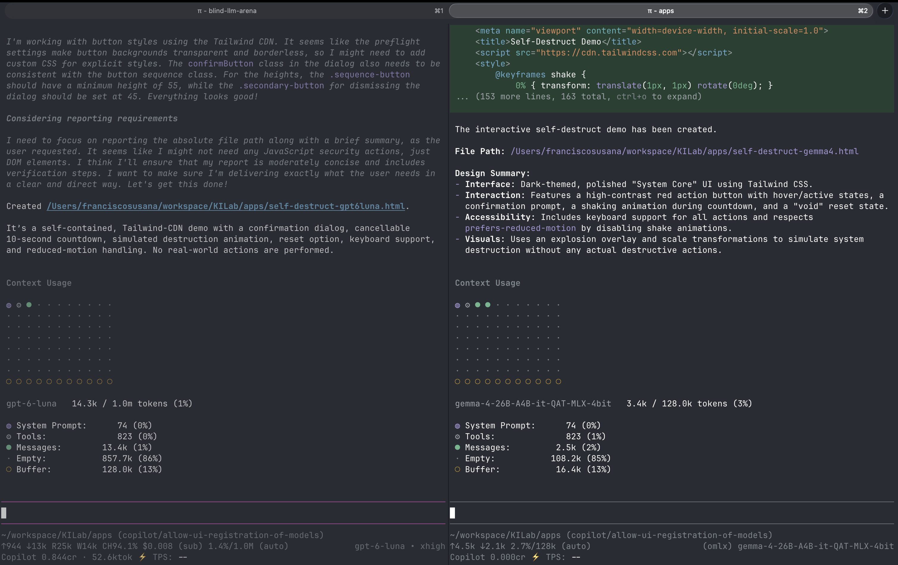

# Results: Frontier vs. Local Model

One run of the [self-destruct prompt](../PROMPT.md) on a frontier model and a local model, in the same harness (Pi).

## Setup

| | Frontier | Local |
|---|---|---|
| Model | `gpt-6-luna` (Copilot, `xhigh` thinking) | `gemma-4-26B-A4B-it-QAT-MLX-4bit` (oMLX) |
| Output | [`self-destruct-gpt6luna.html`](self-destruct-gpt6luna.html) | [`self-destruct-gemma4.html`](self-destruct-gemma4.html) |

## Numbers

From the Pi footer in the screenshot above.

| | gpt-6-luna | gemma-4-26B |
|---|---|---|
| Context used | 14.3k / 1.0M tokens (1%) | 3.4k / 128k tokens (3%) |
| Output tokens | 13k | 2.1k |
| Cost | $0.008 (subscription), 0.844 Copilot credits | 0 credits (local) |
| File size | 28.7 KB | 7.4 KB |

Tokens per second and time to finish were not captured in this run.

## Findings

Both models produced a working page with the core flow: confirmation, 10-second countdown, cancel, a destruction effect, and a reset. The gaps show up in the details. This comes from reading the generated code, not from a scripted test.

| Check | gpt-6-luna | gemma-4-26B |
|---|---|---|
| Confirmation | Custom modal built on `<dialog>`, with a backdrop and a cancel option | Browser's built-in `confirm()` pop-up |
| Countdown display | Ring timer, progress bar, and a telemetry panel | Large number and a shaking card |
| Disabled state | Start button is disabled while the sequence runs | Styles exist, but the button is hidden rather than disabled |
| Keyboard and screen readers | Focus styles, focus moves after cancel and finish, `aria-live` status updates | Enter/Space handler on the buttons; no `aria-live` or other ARIA |
| Reduced motion | Checked in CSS and in JavaScript | Turns off the shake only; the flash and fade still play |
| Reset | In-page reset button | Reloads the page; a separate reset button in the markup is never shown |

## Takeaways

- **The local model delivered the core flow.** A 4-bit 26B model running locally met the main requirements at no usage cost.
- **The frontier model went further on polish and accessibility.** It wrote a custom dialog, live announcements, and a stricter reduced-motion path, and it used about 6x more output tokens.
- **Both runs used little context.** Neither came close to its context window, so context size isn't the limit for a prompt like this.
- **This is a single run.** Repeat the experiment before you draw conclusions, and add your own visual impressions to the table.
